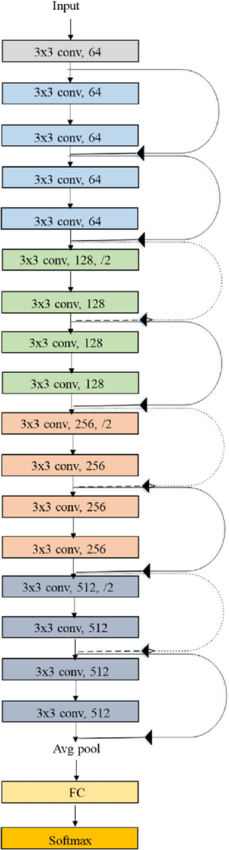
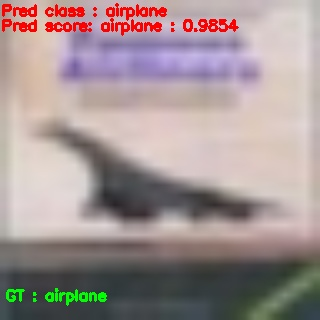

# Resnet18 from scratch
* This repository is about the implementation of `Resnet18` CNN architecture from scratch using pytorch framework and training it from scratch on `CIFAR10` dataset.
* Here, I have implemented the resnet18 architecture from scratch and trained from scratch using pytorch.
* So to learn how to implement the resnet18 architecture from scratch and train from scratch, first of locate this directory and prepare the conda environment for it in your PC.

```bash
cd ResNet18
conda create -n <env_name>
conda activate <env_name>
pip install -r requirements.txt
```

## Implementation of Resnet18
* To impelement the resnet architecture, first of all know/learn about the residual/skip connection, resnet architecture and its experiments on different datasets from its [paper](https://arxiv.org/abs/1512.03385).
* To simply know about the resnet18 architecture only, see the picture given below: \

* To see and learn about the architecture from code, look at this [implementation](architecture.py).

## Model train
* To train the resnet18 CNN model on CIFAR10 dataset from scratch using pytorch, run following command:
```bash
python3 train.py --epochs <number of epochs to train the model> --batch_size <batch size in dataloader>
```

* The weights of each epoch and learning curve will be save in folder named `store`.
* Also saves few images from test set with same resolution as the model's input which will be used in inference.

## Model Inference
* To inference the model on GPU, run following command:
```bash
python3 inference.py
```

* To inference the model on CPU, run following command:
```bash
python3 inference.py --no_cuda
```
* It will save the result in directory `store/INFERENCE` with upsampled resolution.

* Result on CIFAR10 dataset: \
