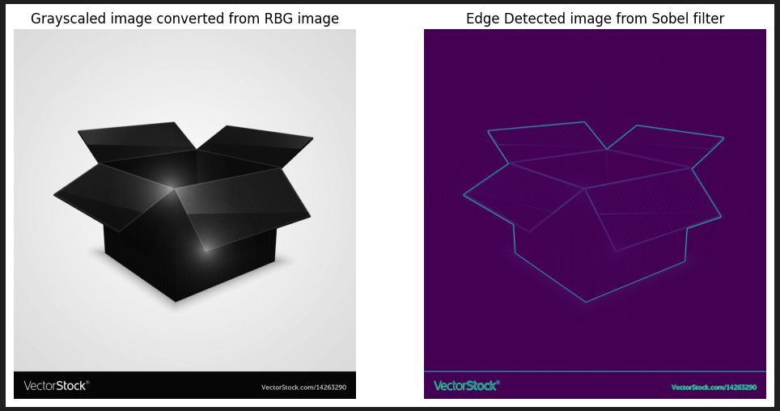

# Sobel Edge Detection
* This notebook is about the edge detection in an image using Sobel Filter/Operator. This sobel edge detector is written from scratch using two kernels.
* The matrices associated with these kernels are given below:
```
Gx = [[1, 0, -1],   
      [2, 0, -2],
      [1, 0, -1]]         
Gy = [[1, 2, 1],
      [0, 0, 0],
      [-1, -2, -1]]
```

       
* Here, we require a grayscaled image, so to convert the RGB image into grayscaled image we need few parameters which are given below:
      1. gamma = 1.400
      2. weights of RBG components: r_constant, g_constant, b_constant = 0.2126, 0.7152, 0.0722

* There are two notebooks where in one i have used numpy for the calculation i.e. sum and multiply [with numpy](Sobel Edge Detection/Sobel_Edge_Detection_with_numpy.ipynb) and another one is without the numpy [without numpy](Sobel Edge Detection/Sobel_edge_without_numpy.ipynb) i.e. wrote own function for that.

# Result 
* Edge detecion result: \
