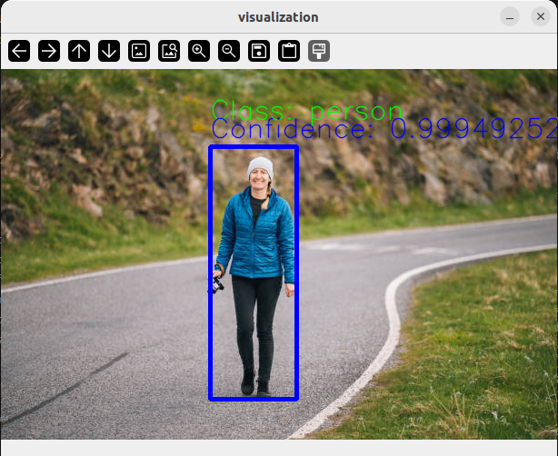
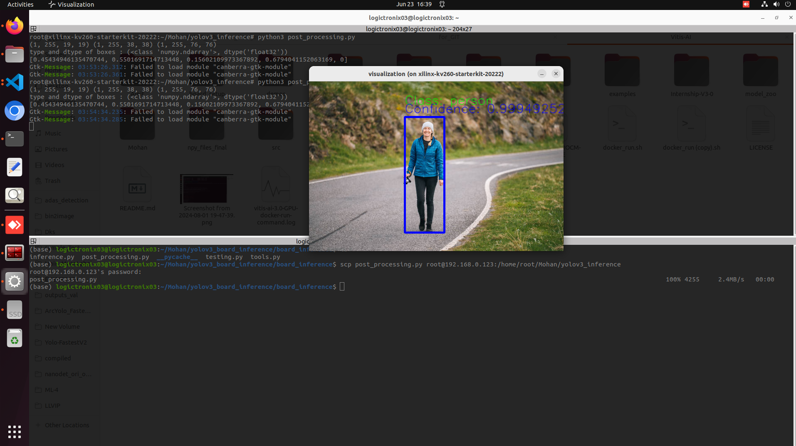
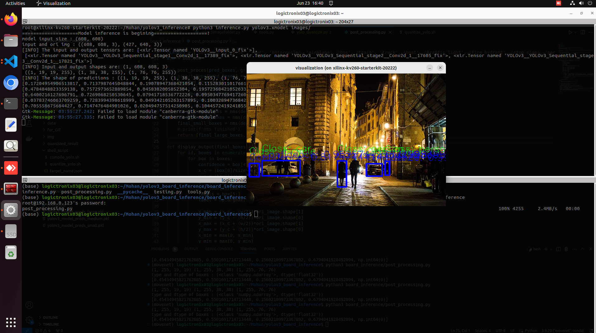

# YoloV3 in KV260 board:
* Here, in yolov3 pretrained weight from darknet converted into pytorch is used.
* To run yolov3 on KV260 board we need to first quantize and compile the model using **Vitis-AI** quantizer and compiler which converts the float model into fixed point (int) model.

# Steps:
* First go to folder 'Yolov3_Board_Inference' using:
```bash
git clone git@github.com:Mohanlal-11/ML.git
cd YOLOv3/Deployment
```
1. Check output from yolov3 model in GPU using:
* Download the pretrained weights from link given in txt file [yolov3_pretrained_weight](weights/yolov3_wts_reference.txt)
```bash 
python3 yolov3/test.py
```
* This will give output like :


2. After verfying model then quantize and compile the model:
* Here, first of activate the vitis environment in your local and locate the path to your folder where model is located i.e.Yolov3_Board_Inference  and then, run following commands:
```bash
python3 code/inspect_yolo.py
bash shell_script/quantize_yolo.sh
bash shell_script/compile_yolo.sh
```
* This will give the quantized model in folder **quantized_result** and compiled model in **compiled_result**.
* And inspection result in folder **code/inspection_results** that shows wheather our model is supportable in **DPU** or not.

3. Check post processing code in GPU without using framework i.e. **'torch'**, only **numpy** used, run following command:
* Here, first of all download the **pickle** files from [pickle_files](download_pkl_file.txt).
```bash
python3 board_inference/post_processing.py
```
* This will outputs:


4. Now upload the following files in board and run the given command:
    1. [inference.py](board_inference/inference.py)
    2. [tools.py](board_inference/tools.py)
    3. [post_processing.py](board_inference/post_processing.py)
    4. yolov3.xmodel
    5. folder that contains '.jpg' or '.jpeg' or '.png' images.

```bash
python3 post_processing.py
```
* This will output:


```bash
python3 inference.py yolov3.xmodel images
```

* The output of yolov3 from board:


