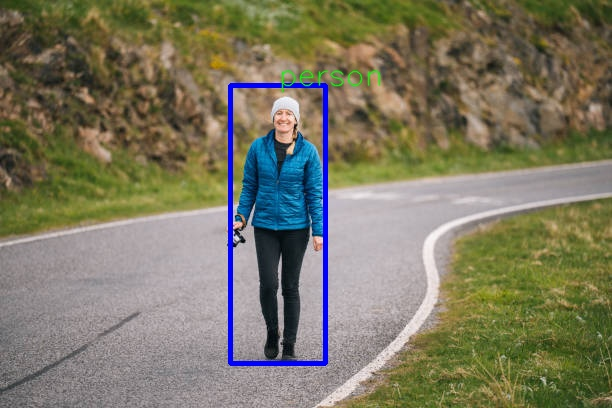

# YOLOv3
* This is about YOLO(You Only Look Once) version3.
* The original **yolov3** was on **Darknet** framework but i tried to write it on **PyTorch** framework.
* Then, i have tried to overfit this on small set of **COCO** dataset to see that if the architecture i wrote was correct or not.

# Installation
* To use this project, you should follow the following commands first:
```bash
git clone git@github.com:Mohanlal-11/ML.git
cd YOLOv3
pip install -r YOLOv3/requirements.txt
```

# To see demo/inference
* Here, i have used the weight from the original yolov3's website, but after converting it into **pytorch** format.
* Download the weight [pretrained_weights](https://drive.google.com/file/d/1G3bDza_qtRbtPt0s1Oj68D7PXjLBrhx6/view?usp=sharing).

```bash
python3 test.py /path/to/pretrained_weights
```
# Result
* Result from demo: \


# To train
* To train this yolov3 model, first run the following command:
```bash 
mkdir coco_train
mkdir coco_valid
```
* Then, download the **coco** dataset and put it into the folder **coco_train**.
* The coco dataset must be in following format:
    ```plaintext
    coco_train
        |---data
        |---labels.json
    coco_valid
        |---data
        |---labels.json
    ```

* At last
```bash 
python3 train_fn.py
```

# References
* I took reference from following links:
    * https://github.com/miladlink/YoloV3/tree/master
    * https://github.com/pjreddie/darknet/blob/master/cfg/yolov3.cfg
    * https://arxiv.org/abs/1804.02767

# If you want to deploy this object detection model in **Kria KR260** FPGA board, then follow this [README.md](Deployment/README.md)