# YOLOv5 in FPGA
* This repo is about how can we deploy the **yolov5** object detection model on **Kria KV260** FPGA board.
* To deploy yolov5 in FPGA board, we need to modify the layers of the model because all of the layers of yolov5 are not supportable in **DPU** of FPGA board. So, we need to find out those unsupported layers/operators either by mannually reading from [here](https://docs.amd.com/r/3.0-English/ug1414-vitis-ai/Operators-Supported-by-PyTorch) or by doing inspection.

## About YOLOv5:
* Yolov5 build upon the foundation laid by YOLO that has granered significant attention due to its exceptional performance and efficiency.
* This model addresses the trade-off between accuracy and inference speed across various yolov5 variants **(n,s,m,l,x)**. \
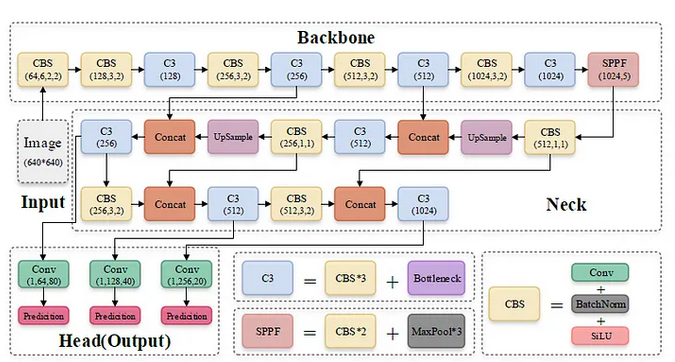
### Architecture:
* The architecture of yolov5 consists of three stages i.e. **Backbone, Neck and Head**.
1. **Backbone:**
* It is basically a stack of convolutional layers that extracts the features from input image at different scales.
* Here, backbone is **modified CSPDarknet53**.
* It stacks multiple **CBS (Convolution + BatcNormalization + SiLU)** modules and **C3** modules and at last it has **SPPF** module which is used to increase the **receptive** field of the model.
* Here, **CBS** is used to assist the **C3** module in feature extraction process.

2. **Neck:**
* This stage combines the features of different scales came from  backbone and produces the fine-grained fetures so that the objects of different scales can be detected.
* Yolov5 uses **PAN (Path Aggregation Network)** in neck which first **upsamples** the high level feature maps and comibines with low level feature maps and **downsamples** the low level feature maps which is then combines with high level featur maps to produce fine-grained features as shown in figure below: \
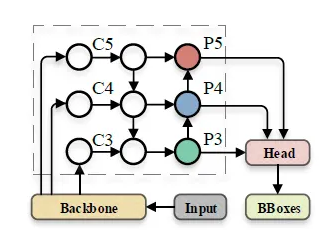

3. **Head:**
* This stage generates the final outputs i.e. bounding box offsets and
logits for class probabilities.
* In head of yolov5, the ouput are decoded in different format than in previous **yolo**.
* The equations used to decode the ouput of yolov5 are: \
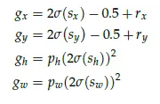
* Here, **sx, sy** are predicted center point of bounding boxes which are relative to **top left** corner of cell of grid, **sh, sw** are predicted offset bounding box height and width, **rx, ry** are top left corner point of cell of grid and **ph, pw** are height and width of **anchors**.

## Model Check:
* As we know that the author of yolov5 is **Ultralytics** who developed yolov5 architecture on the basis of previous YOLO and also it was the first time the yolo version was implemented using **PyTorch**.
* We can use different variants of yolov5 for object detection from official github repo of ultralytics as i have mentioned in referece section [4].
* But here, i have used yolov5 object detection model from a github repo as i have mentioned reference section [1]. This repo is also referenced from ultralytics and there is no difference in model so i used this repo.
* So first of all, i have checked the architecture and  model by using its pretrained weight to make sure that the model is working or not, which was good.
* There was no python script for the inference, but there is jupyter notebook. So i created an inference and evaluation scirpt for this.
* First:
* Either clone using following command or use folder [yolov5-PyTorch](YOLOv5-PyTorch)
```bash 
git clone https://github.com/Okery/YOLOv5-PyTorch.git
```
```bash 
conda create -n yolov5 python=3.9.20
pip install -r requirements.txt
```
* Then,
```bash
python3 inference_modified.py --model_size nano/small --pretrain --coco
python3 eval.py
```
* Here, **inference.py** for original architecture and **inference_modifieds.py** is for DPU supportable architecture. And in evaluation script, do not forget to edit weight path and model size.

* Then trained for few epochs on **COCO2017** dataset to check that can i train it on my custom dataset or not, found that we can train on custom dataset by using these scripts.

* Here, the dataset must be in following format: 
```Plaintext 
├── COCO 
	├── annotations
        ├── instances_train2017.json
		├── instances_val2017.json
    ├── images
        ├── train2017
            ├── 1111.jpg
            ├── 2222.jpg
        ├── val2017
            ├── 1111.jpg
            ├── 2222.jpg
```
* Download the coco2017 dataset [COCO2017](https://cocodataset.org/#download)

* To train on custom dataset, we need to first generate the **anchor boxes** of our custom dataset on desired input size by using following command
```bash 
python3 yolo/anchor_generate.py
```
* Do not forget to edit the path to your dataset in this script.
* Then, train the model by using:
```bash
python3 train.py --model-size nano/small --use-cuda --mosaic
```
* **To overfit the model in small dataset like in 16,20 images, do not forget to fine tune parameters such as increase warmup epoch, learning rate adjustment, input size as per your dataset from this line [train.py](train.py#L229).**
* And to train model on large dataset like coco2017 reduce the value of [warmup epoch](train.py#L258) and other parameters if needed.

## Deployment:
* To deploy any **CNN** model, we need to first check that our model is supportable in **DPU** or not otherwise we will get multiple **DPU subgraph** and we have to run model in **DPU** and **CPU** separately.

### Inspection:
* Setup the Vitis-AI Docker in your Host machine by following this [documentation](https://xilinx.github.io/Vitis-AI/3.0/html/docs/install/install.html#docker-install-and-verification).
* Use **inspector** from **pytorch_nndct.apis** in **Vitis-AI**.
* Run following command in **Vitis-AI** docker after locating **yolov5** folder from vitis ai docker.
```bash
python3 Deployment/inspect_yolo.py
```

* If some operators can't be assigned to DPU, message like this can be seen: \
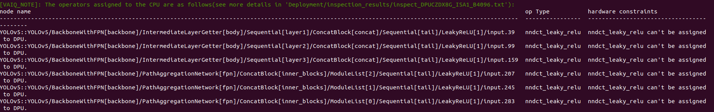
* And also inspector gives a **svg** image where we can see those operators which are assigned to **CPU** are in **RED** oval and those which are assigned to **DPU** are in **BLUE** oval. \
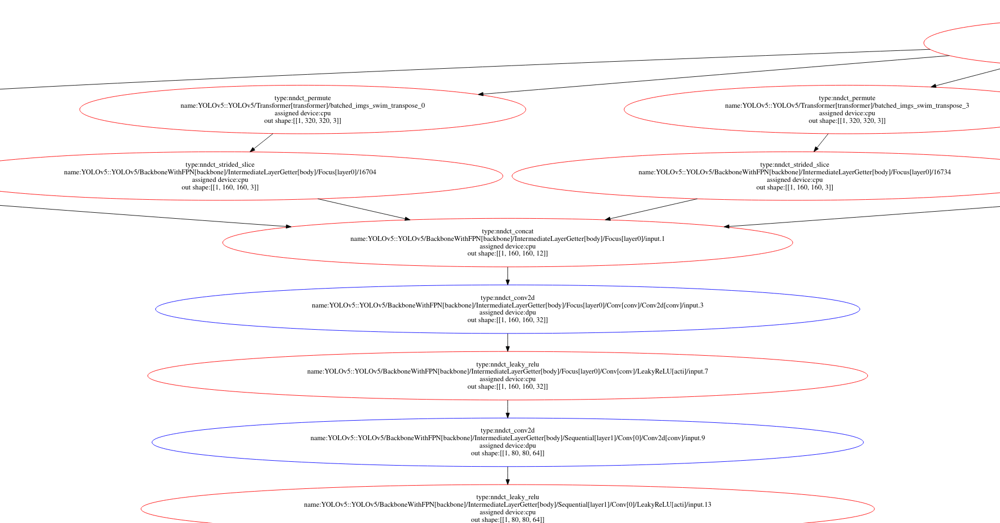

## Unsupported operators found in Yolov5:
* Sigmoid activation function.
* Negative slope of LeakyReLU.
* Tensor slicing.

## Made unsupported operators supportable in FPGA
* Since **LeakyReLU** with negative slope **0.1** throws this error: **YOLOv5__YOLOv5_BackboneWithFPN_backbone__IntermediateLayerGetter_body__Focus_layer0__Conv_conv__Conv2d_conv__input_3, type = conv2d-fix has been assigned to CPU: (DPU does not support activation type: LEAKYRELU. Its alpha is 0.100000, but DPU only support 0.1015625.)**, replaced negative slope of leaky relu activation function by **(26/256 = 0.1015625)**.
* Replaced **torch.sigmoid()** function by **torch.Hardsigmoid()** because sigmoid is not supported in DPU.
* Put **Transformer** class outside of **YOLOv5** class(model) because it performs augmentation and preprocessing steps like flip, mosaic, resize, etc which contains unsupported operators like tensor slicing, permute,etc.
* Put the post processing steps happening during the evaluation/inference at the last layer of head that contains unsupported operators like permute, view, etc outside of the model.
* Replaced tensor slicing steps in backbone **(in Focus class)** by a convolutinal layer: \
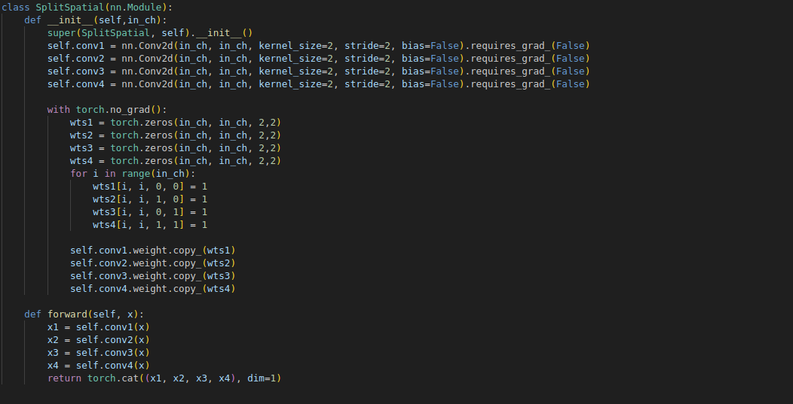
* Since, LeakyReLU used with batchnormalization only  and from Vitis-AI User Guide 1414 **Activations would be fused to adjacent operations such as convolution and add**. So added a convolutional layer with leakyrelu function which has non-trainable parameters and weights are all 1.
* After replacing all these operator, the **inspector** will gives a message like this: \
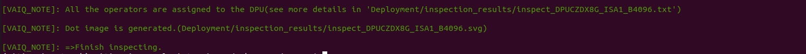
* Then the inspector will give an svg image where we can see all the operators are assigned to DPU and are in **blue** oval. \
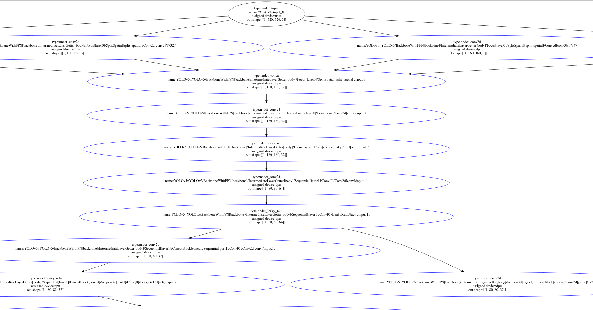

## Result:
* From default yolov5 architecture using given pretrained weight, plotted on original image **where input images was resized using padding to keep aspect ratio same of original and resized image**: \
	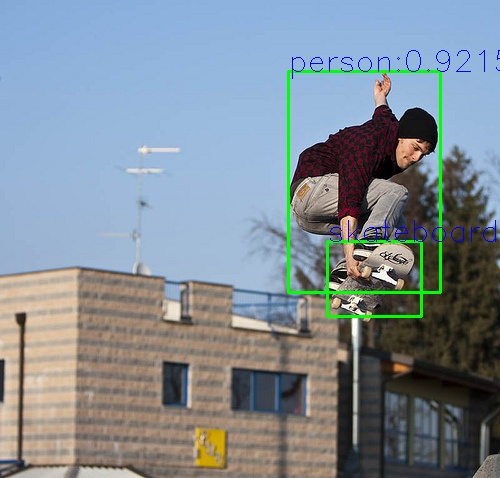
* From **DPU supportable** yolov5 architecture using given pretrained weight, plotted on resized image **where input image and plotted image was resized using opencv without considering its aspect ratio**: \
	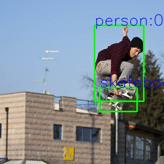

## Quantization and Compilation:
* Quantized and compiled yolov5 with **Vitis-AI** quantizer and compiler.
* After locating yolov5 folder from vitis-ai docker, follow this [README.md](Deployment/quantize_yolo.md) to quantize and compile the model.
* During quantization, if there is no error in quantization code and in model, then we can see the logs like this: \
 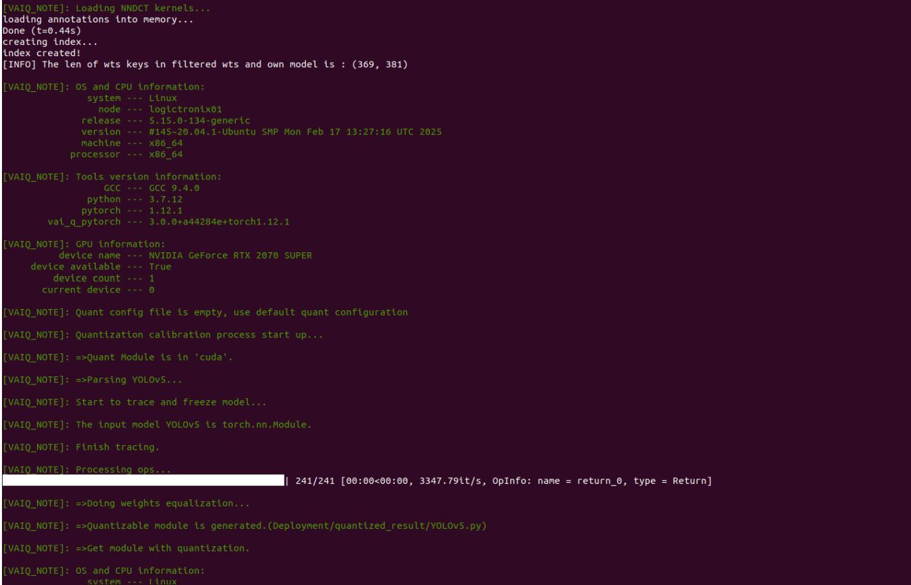
* And after successful quantization and compilation, we will get a compiled model **(.xmodel)** whose **number of DPU subgraphs are 1**. \
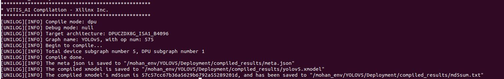

## Inference on board:
* After writing inference script to run model on DPU, and preprocessing and post processing on CPU which is independent of framework i.e. pytorch, successfully run on board and got output.
* Upload following scripts and compiled model on your board location:
1. [board_post_process.py](Deployment/board_scripts/board_post_process.py) 
2. [board_utils.py](Deployment/board_scripts/board_utils.py) 
3. [inference_yolov5.py](Deployment/board_scripts/inference_yolov5.py) 

* To inference compiled model on board, run following command on board:
```bash
python3 inference_yolov5.py yolov5.xmodel path/to/image/folder
```

* Here, i have ready made board which has DPU. You can setup your board with DPU overlay by checking the documentations. 
* Here,the output from board: \
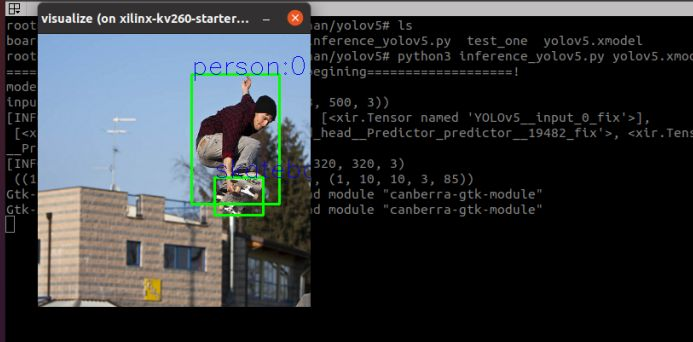

## Pretrained models:
* Pretrained model of default architecture which can also use in DPU supportable architecture is [yolov5s.pth](https://drive.google.com/file/d/16SqPUKcX-Bzy7gC3Lia0nLIdHYOepKAZ/view?usp=sharing)
* Compiled yolov5 model [yolov5.xmodel](https://drive.google.com/file/d/1YsqxX3zSkZo9WLiJYpS4-Ug8IKZkk9jR/view?usp=sharing)

## References:
[1] Yolov5 used to implement on board: [yolov5 ref repo](https://github.com/Okery/YOLOv5-PyTorch) \
[2] To understand about yolov5: [Medium](https://sh-tsang.medium.com/brief-review-yolov5-for-object-detection-84cc6c6a0e3a) \
[3] Overview of yolov5 architecture: [yolov5 overview](https://arxiv.org/html/2407.20892v1) \
[4] Yolov5 ultralytics: [original repo](https://github.com/ultralytics/yolov5) \
[5] Vitis-AI tutorial for board inference: [vitis-ai-tutorial](https://github.com/Xilinx/Vitis-AI-Tutorials/blob/3.5/Tutorials/PyTorch-ResNet18/files/code/test.py) \
[6] To write inference script for board: [vitis-ai resnet50 demo](https://github.com/Xilinx/Vitis-AI/blob/1.4/demo/VART/resnet50_mt_py/resnet50.py) \
[7] Detailed architecture of yolov5: [detailed architecture](https://miro.medium.com/v2/resize:fit:720/format:webp/1*mtTOwoiMImWagaZbYTm3ew.png)